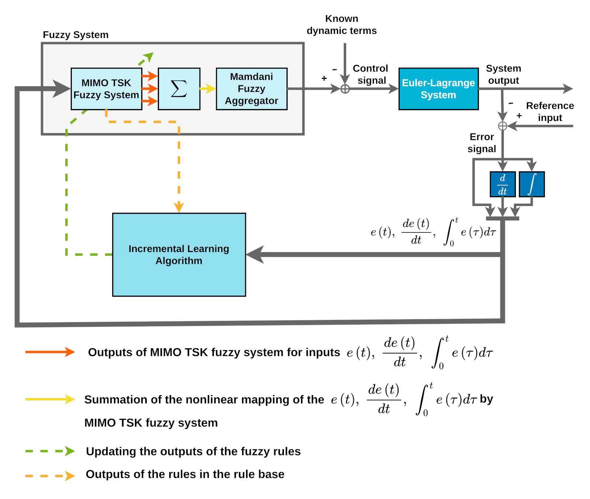
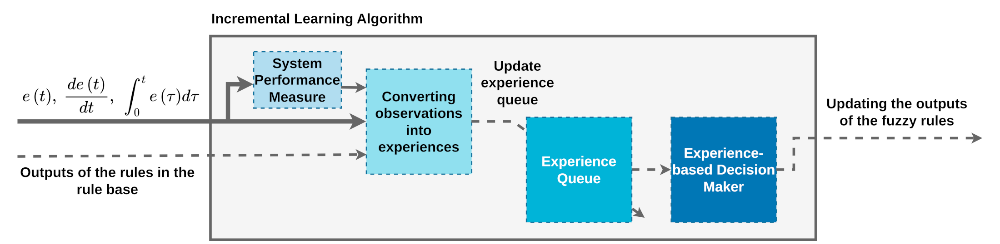

# Supplementary Materials for the Article: "An Incremental Learning-Based Fuzzy Control Scheme for a Class of Uncertain Euler–Lagrange Systems"

Initial code and data obtained during the training process of an incremental learning-based fuzzy controller are provided in this repository. The results of our study have been published as "_**An Incremental Learning-Based Fuzzy Control Scheme for a Class of Uncertain Euler–Lagrange Systems**_" in the "_**Iranian Journal of Fuzzy Systems**_". 

**Notice that the codes does not include the HEO algorithm and different scenarios of simulation.**

